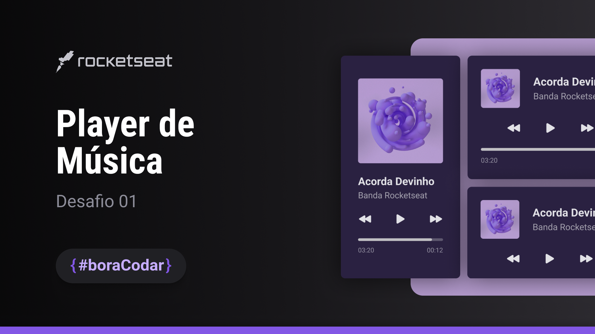

# #boraCodar

  Projetos `#boraCodar` da Rocketseat  
  <a href="https://boracodar.dev">Acesse os desafios clicando aqui</a> 
   
  <table>
    <thead>
        <tr>
            <th align="center">
                 
                

                    <small>#</small>
                

            </th>
            <th align="center">
                 
                
 
                    <small>
                      NAME
                    </small>
                

            </th>
            <th align="center">
                
                
 
                    <small>
                    DEPLOY
                    </small>
                

            </th>
            <th align="center">
                
                
 
                    <small>
                    PREVIEW
                    </small>
                

            </th>
        </tr>
    </thead>
    <tbody>
        <tr>
            <td>01</td>
            <td>
              <a href="https://github.com/PabloXT14/boracodar-01" target="_blank">Music Player</a>
            </td>
            <td align="center">
              <a href="https://pabloxt14-music-player.vercel.app/" target="_blank">Link</a>
            </td>
            <td align="center">
              
            </td>
        </tr>
    </tbody>
  </table>

---

  Feito com 💙 por Pablo Alan

