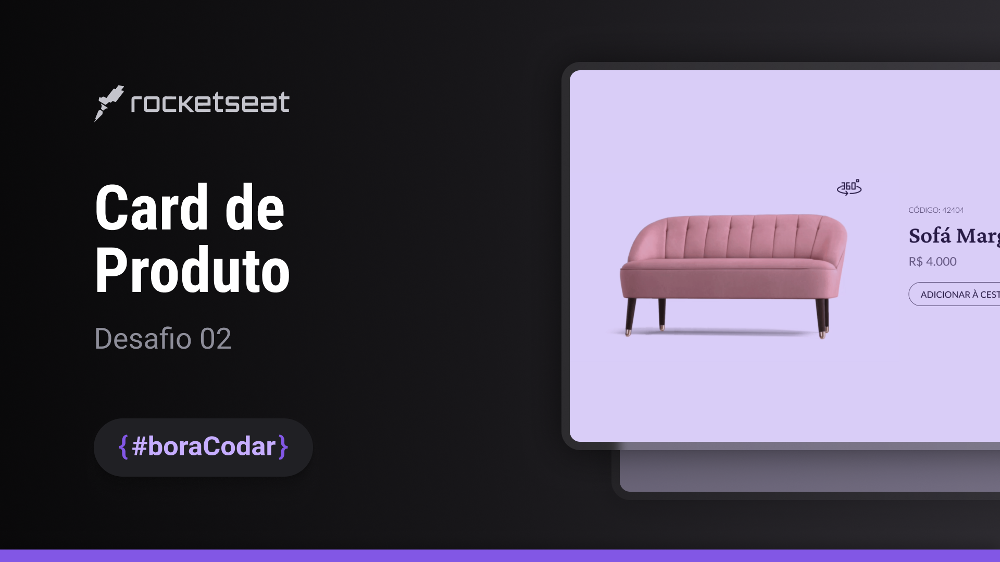
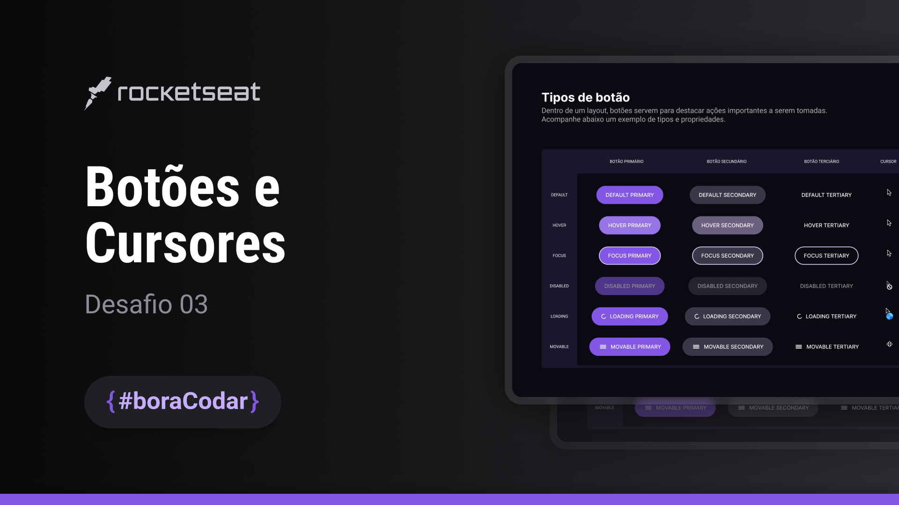

# #boraCodar

  Projetos `#boraCodar` da Rocketseat
   
  <a href="https://boracodar.dev">Acesse os desafios clicando aqui</a>
   
   
  <table>
    <thead>
      <tr>
        <th align="center">
           
          

            <small>#</small>
          

        </th>
        <th align="center">
           
          
 
            <small>
              NAME/REPO
            </small>
          

        </th>
        <th align="center">
          
          
 
            <small>
              DEPLOY
            </small>
          

        </th>
        <th align="center">
          
          
 
            <small>
              PREVIEW
            </small>
          

        </th>
      </tr>
    </thead>
    <tbody>
      <tr>
        <td>01</td>
        <td align="center">
          <a href="https://github.com/PabloXT14/boracodar-01" target="_blank">Music Player</a>
        </td>
        <td align="center">
          <a href="https://pabloxt14-music-player.vercel.app/" target="_blank">Link</a>
        </td>
        <td align="center">
          
        </td>
      </tr>
      <!--  -->
      <tr>
        <td>02</td>
        <td align="center">
          <a href="https://github.com/PabloXT14/boracodar-02" target="_blank">Product Card</a>
        </td>
        <td align="center">
          <a href="https://pabloxt14-product-card.vercel.app/" target="_blank">Link</a>
        </td>
        <td align="center">
          
        </td>
      </tr>
      <!--  -->
      <tr>
        <td>03</td>
        <td align="center">
          <a href="https://github.com/PabloXT14/boracodar-03" target="_blank">Buttons & Cursors</a>
        </td>
        <td align="center">
          <a href="https://pabloxt14-buttons-and-cursors.vercel.app/" target="_blank">Link</a>
        </td>
        <td align="center">
          
        </td>
      </tr>
    </tbody>
  </table>

---

  Feito com 💙 por Pablo Alan

